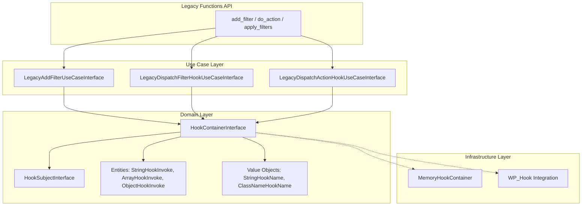

# SpeedySpec WP Hook Domain

A modern, domain-driven reimplementation of WordPress's Hook API (actions and filters system). This library provides a clean, testable, and extensible architecture for event-driven programming with full backwards compatibility with WordPress's plugin API.

## Features

- **Domain-Driven Design**: Clean separation of concerns with contracts, entities, value objects, and services
- **Testable Architecture**: Dependency injection and interface-based design make testing straightforward
- **WordPress Compatible**: Drop-in replacement for WordPress's `add_filter()`, `do_action()`, and related functions
- **Type-Safe**: Full PHP 8.4+ type declarations with strict types
- **Extensible**: Implement your own storage backends (memory, database, etc.)
- **Flexible Callbacks**: Support for dedicated action and filter callback types

## Requirements

- PHP 8.4 or higher

## Installation

```bash
composer require speedyspec/speedyspec-wp-hook-domain
```

## Quick Start

### 1. Configure the Service Container

Register your infrastructure implementations with the service container:

```php
use SpeedySpec\WP\Hook\Domain\HookServiceContainer;
use SpeedySpec\WP\Hook\Domain\Contracts\HookContainerInterface;
use SpeedySpec\WP\Hook\Domain\Contracts\UseCases\LegacyAddFilterUseCaseInterface;
// ... other interfaces

$container = HookServiceContainer::getInstance();

// Register your implementations
$container->add(HookContainerInterface::class, fn($c) => new YourHookContainer());
$container->add(LegacyAddFilterUseCaseInterface::class, fn($c) => new YourAddFilterUseCase());
// ... register other use cases
```

### 2. Use the Legacy API (WordPress-Compatible)

Once configured, include the functions file and use the familiar WordPress API:

```php
require_once 'vendor/speedyspec/speedyspec-wp-hook-domain/functions/plugins.php';

// Add a filter using a named function
function my_content_modifier($value) {
    return $value . ' modified';
}
add_filter('my_filter', 'my_content_modifier');

// Apply the filter
$result = apply_filters('my_filter', 'original');
// Result: 'original modified'

// Add an action using an object method
class MyPlugin {
    public function handleAction($arg) {
        echo "Action fired with: $arg";
    }
}
$plugin = new MyPlugin();
add_action('my_action', [$plugin, 'handleAction']);

// Fire the action
do_action('my_action', 'hello');
// Output: Action fired with: hello
```

> **Warning: Never use anonymous closures with the legacy API**
>
> ```php
> // DO NOT DO THIS - closures cannot be removed!
> add_filter('my_filter', function($value) {
>     return $value . ' modified';
> });
> ```
>
> Anonymous closures cannot be removed with `remove_filter()` or `remove_action()` because
> each closure has a unique internal identifier. Always use named functions, static methods,
> or object methods that can be referenced for removal.

### 3. Use the Modern API (Domain Objects)

For new code, use the domain objects directly. Priority is now built into the callback entities:

```php
use SpeedySpec\WP\Hook\Domain\HookServiceContainer;
use SpeedySpec\WP\Hook\Domain\Contracts\HookContainerInterface;
use SpeedySpec\WP\Hook\Domain\ValueObject\StringHookName;
use SpeedySpec\WP\Hook\Domain\Entities\ObjectHookInvoke;

$container = HookServiceContainer::getInstance();
$hooks = $container->get(HookContainerInterface::class);

// Add a filter with priority 10 (default)
$hookName = new StringHookName('my_filter');
$callback = new ObjectHookInvoke(fn($value) => strtoupper($value));

$hooks->add($hookName, $callback);

// Add a filter with custom priority
$highPriorityCallback = new ObjectHookInvoke(
    fn($value) => $value . '!',
    priority: 5  // Runs before priority 10
);
$hooks->add($hookName, $highPriorityCallback);

// Apply the filter
$result = $hooks->filter($hookName, 'hello');
// Result: 'HELLO!' (priority 5 runs first, then priority 10)
```

## Architecture Overview



### Directory Structure

```
src/
├── Contracts/              # Interfaces defining the API
│   ├── HookContainerInterface.php
│   ├── HookPriorityInterface.php
│   ├── HookSubjectInterface.php
│   ├── HookInvokableInterface.php
│   ├── HookNameInterface.php
│   ├── HookActionInterface.php
│   ├── HookFilterInterface.php
│   ├── HookValidationInterface.php
│   ├── CalledDeprecatedHookInterface.php
│   ├── CurrentHookInterface.php
│   ├── HookRunAmountInterface.php
│   └── UseCases/
│       └── Legacy*UseCaseInterface.php
├── Entities/               # Callback wrappers (with built-in priority)
│   ├── StringHookInvoke.php
│   ├── ArrayHookInvoke.php
│   └── ObjectHookInvoke.php
├── ValueObject/            # Immutable value types
│   ├── StringHookName.php
│   └── ClassNameHookName.php
├── Services/               # Domain services
│   ├── CurrentHookService.php
│   └── HookRunAmountService.php
├── Exceptions/             # Domain exceptions
│   └── HookIsNotCallableException.php
└── HookServiceContainer.php  # Dependency injection container

functions/
└── plugins.php             # WordPress-compatible function API
```

## Documentation

For comprehensive documentation, see the [docs](./docs) directory:

- [Architecture](./docs/architecture.md) - Design principles and patterns
- [Contracts](./docs/contracts.md) - Interface documentation
- [Entities](./docs/entities.md) - Callback wrapper classes
- [Value Objects](./docs/value-objects.md) - Immutable value types
- [Services](./docs/services.md) - Domain services
- [Legacy API](./docs/legacy-api.md) - WordPress-compatible functions

## Related Packages

- `speedyspec/speedyspec-wp-hook-infra-memory` - In-memory implementation
- `speedyspec/speedyspec-wp-hook-infra-wp` - WordPress integration

## License

BSD-3-Clause
