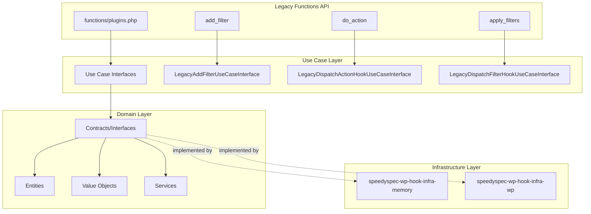
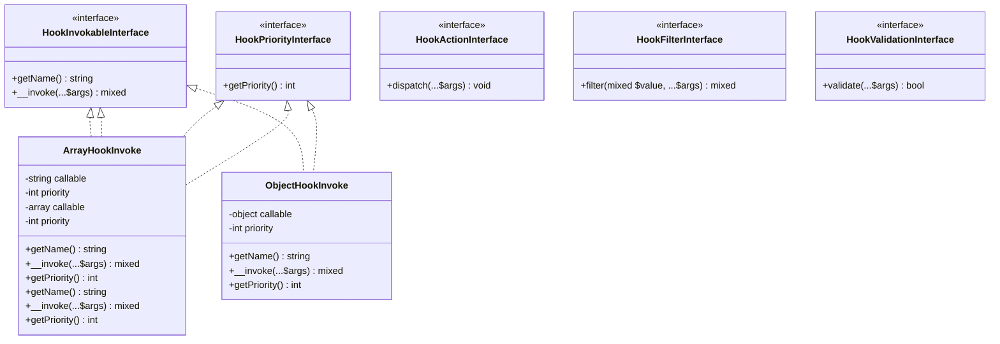
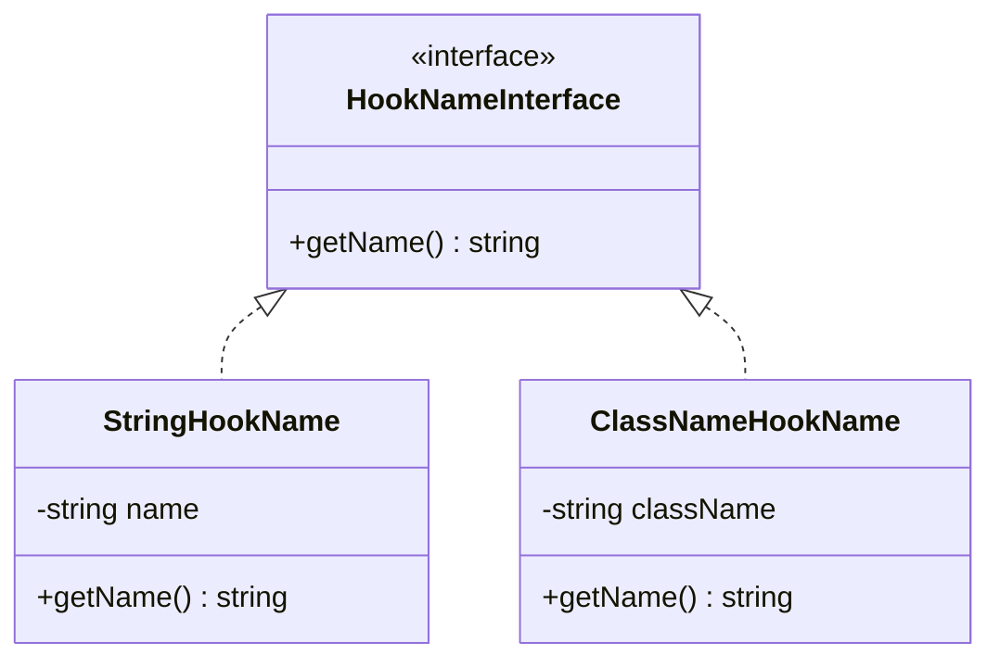
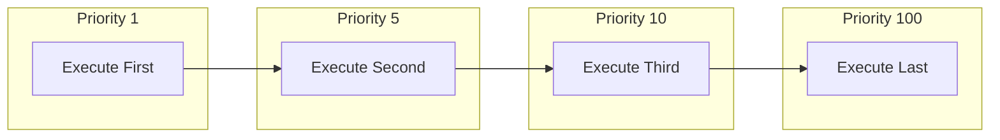
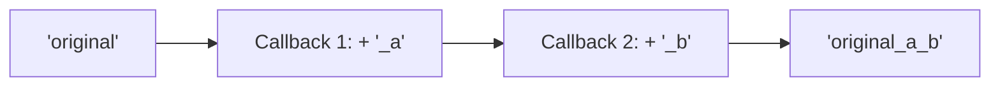
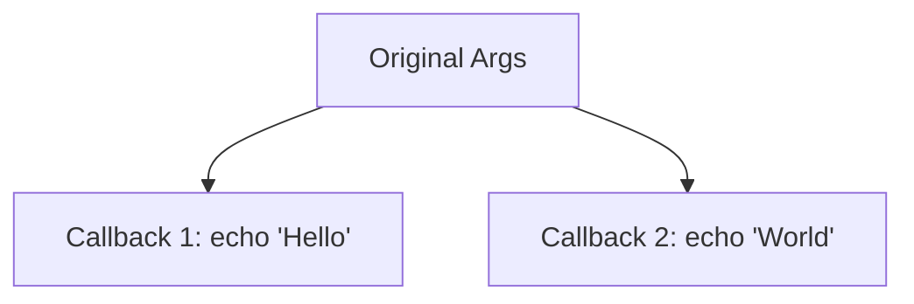
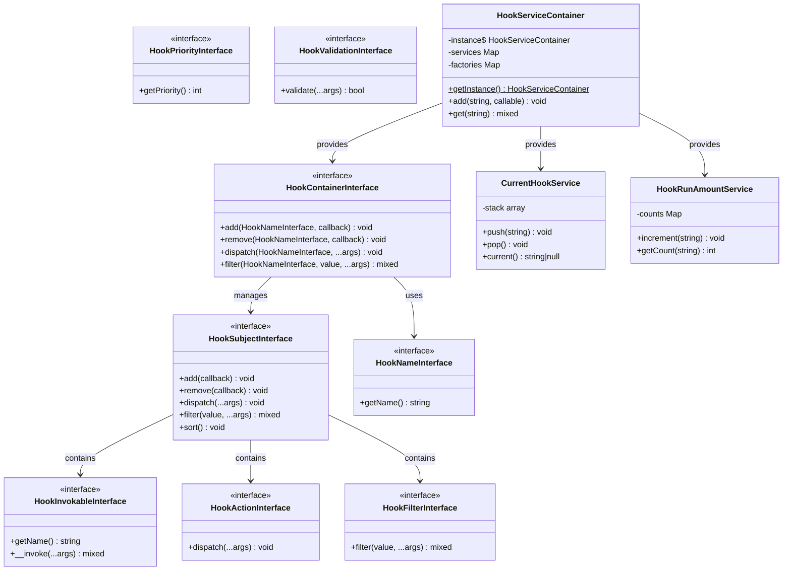

# Architecture

This document describes the architectural design and principles of the SpeedySpec WP Hook Domain library.

## Design Philosophy

The library follows **Domain-Driven Design (DDD)** principles to create a clean, maintainable, and testable
implementation of WordPress's hook system. The architecture separates the domain logic from infrastructure concerns,
allowing different storage backends and making the codebase highly testable.

## Layered Architecture



## Core Concepts

### 1. Hook Container

The `HookContainerInterface` is the central registry for all hooks. It manages multiple hook subjects (one per hook name) and provides methods to:

- **Add** callbacks to hooks
- **Remove** callbacks from hooks
- **Dispatch** actions (fire callbacks without return values)
- **Filter** values through callbacks

```php
interface HookContainerInterface {
    public function add(
        HookNameInterface $name,
        HookInvokableInterface|HookActionInterface|HookFilterInterface $callback
    ): void;

    public function remove(
        HookNameInterface $hook,
        HookInvokableInterface|HookActionInterface|HookFilterInterface $callback
    ): void;

    public function dispatch(HookNameInterface $hook, ...$args): void;

    public function filter(HookNameInterface $hook, mixed $value, ...$args): mixed;
}
```

### 2. Hook Subject (Observer Pattern)

Each named hook is represented by a `HookSubjectInterface`. The subject maintains a collection of callbacks and handles:

- Adding and removing callbacks
- Sorting callbacks by priority
- Dispatching/filtering through all registered callbacks

This implements the **Observer Pattern** where:
- The subject is the hook
- Observers are the registered callbacks

### 3. Hook Invokables (Strategy Pattern)

Callbacks are wrapped in `HookInvokableInterface` implementations, allowing different types of callables to be handled uniformly:

- `ArrayHookInvoke` - Function name strings (e.g., `'strtoupper'`)
- `ArrayHookInvoke` - Array callables (e.g., `[$object, 'method']` or `['ClassName', 'staticMethod']`)
- `ObjectHookInvoke` - Closures and invokable objects

This is the **Strategy Pattern** - different callback types share a common interface but have different invocation strategies.

### 4. Callback Type Interfaces

The library supports specialized callback types through dedicated interfaces:



### 5. Value Objects

Immutable objects that represent domain concepts:

- `StringHookName` - A hook name as a string
- `ClassNameHookName` - A hook name derived from a class



### 6. Service Container

The `HookServiceContainer` provides dependency injection for the entire system. It's a singleton that:

- Registers service factories
- Caches service instances
- Provides type-safe service retrieval

## Design Patterns Used

| Pattern | Usage |
|---------|-------|
| **Observer** | Hook subjects notify registered callbacks when dispatched |
| **Strategy** | Different invokable types (string, array, object) handle callback execution |
| **Singleton** | Service container provides a single point of access |
| **Factory** | Service factories create instances on demand |
| **Repository** | Hook container stores and retrieves hook subjects |
| **Value Object** | Immutable hook names |

## Dependency Injection

The library uses constructor injection and a service container to manage dependencies:

```php
// Infrastructure registers implementations
$container = HookServiceContainer::getInstance();

$container->add(
    HookContainerInterface::class,
    fn($c) => new MemoryHookContainer(
        $c->get(HookRunAmountService::class),
        $c->get(CurrentHookService::class)
    )
);
```

This approach:
- Makes dependencies explicit
- Enables easy testing with mocks
- Allows swapping implementations

## Priority System

Callbacks are executed in priority order (lower numbers first). Priority is now built directly into each callback entity:



```php
// Priority is set in the entity constructor
$callback1 = new ObjectHookInvoke($callable, priority: 1);   // Runs first
$callback2 = new ObjectHookInvoke($callable, priority: 5);   // Runs second
$callback3 = new ObjectHookInvoke($callable, priority: 10);  // Runs third (default)
$callback4 = new ObjectHookInvoke($callable, priority: 100); // Runs last
```

Callbacks at the same priority are executed in registration order.

## Filter vs Action

The library distinguishes between two types of hooks:

### Filters

Modify and return a value. Each callback receives the output of the previous callback.



```php
$value = 'original';
// Callback 1: return $value . '_a';  →  'original_a'
// Callback 2: return $value . '_b';  →  'original_a_b'
$result = 'original_a_b';
```

### Actions

Execute side effects. Each callback receives the original arguments.



```php
// Callback 1: echo 'Hello';  →  Output: Hello
// Callback 2: echo 'World';  →  Output: World
// Both receive same original args
```

## Complete Class Diagram



## Thread Safety Considerations

The current implementation is **not thread-safe**. For concurrent environments:

1. Use separate container instances per thread/request
2. Implement locking in your infrastructure layer
3. Consider immutable hook registrations

## Extensibility Points

### Custom Hook Names

Implement `HookNameInterface` for custom hook naming strategies:

```php
class EventHookName implements HookNameInterface {
    public function __construct(private string $eventClass) {}

    public function getName(): string {
        return 'event:' . $this->eventClass;
    }
}
```

### Custom Callback Types

Implement `HookInvokableInterface` and optionally `HookPriorityInterface` for new callback types:

```php
class QueuedHook implements HookInvokableInterface, HookPriorityInterface {
    public function __construct(
        private Closure $callback,
        private int $priority = 10,
    ) {}

    public function getName(): string { /* ... */ }

    public function __invoke(...$args): mixed {
        // Queue for async execution instead of immediate
    }

    public function getPriority(): int {
        return $this->priority;
    }
}
```

### Dedicated Action/Filter Callbacks

Implement `HookActionInterface` or `HookFilterInterface` for type-safe callbacks:

```php
class MyActionCallback implements HookActionInterface, HookPriorityInterface {
    public function __construct(private int $priority = 10) {}

    public function dispatch(...$args): void {
        // Handle action
    }

    public function getPriority(): int {
        return $this->priority;
    }
}

class MyFilterCallback implements HookFilterInterface, HookPriorityInterface {
    public function __construct(private int $priority = 10) {}

    public function filter(mixed $value, ...$args): mixed {
        // Transform and return value
        return strtoupper($value);
    }

    public function getPriority(): int {
        return $this->priority;
    }
}
```

### Custom Storage Backends

Implement `HookContainerInterface` and `HookSubjectInterface` for:
- Database-backed hooks
- Redis-cached hooks
- Distributed hook systems
