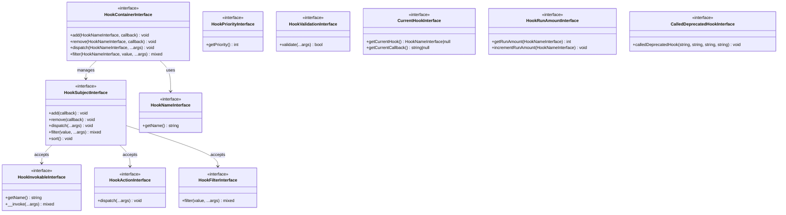
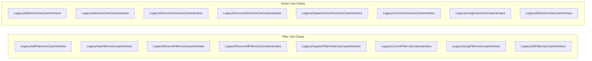

# Contracts (Interfaces)

This document describes all interfaces defined in the domain layer. Implementations must fulfill these contracts to integrate with the hook system.

## Interface Hierarchy



## Core Contracts

### HookContainerInterface

The central registry for all hooks. Manages hook subjects and provides the main API for adding, removing, and executing hooks.

**Namespace:** `SpeedySpec\WP\Hook\Domain\Contracts`

```php
interface HookContainerInterface {
    public function add(
        HookNameInterface $name,
        HookInvokableInterface|HookActionInterface|HookFilterInterface $callback
    ): void;

    public function remove(
        HookNameInterface $hook,
        HookInvokableInterface|HookActionInterface|HookFilterInterface $callback
    ): void;

    public function dispatch(HookNameInterface $hook, ...$args): void;

    public function filter(HookNameInterface $hook, mixed $value, ...$args): mixed;
}
```

**Methods:**

| Method | Description |
|--------|-------------|
| `add()` | Register a callback for a hook |
| `remove()` | Unregister a callback from a hook |
| `dispatch()` | Fire all callbacks for an action hook |
| `filter()` | Pass a value through all callbacks for a filter hook |

**Callback Type Union:**

The `add()` and `remove()` methods accept a union type for callbacks:
- `HookInvokableInterface` - General-purpose callable wrapper
- `HookActionInterface` - Action-specific callbacks (dispatch only)
- `HookFilterInterface` - Filter-specific callbacks (filter only)

**Implementation Notes:**
- Should create hook subjects lazily (on first access)
- Must handle the `all` hook for global listeners
- Should track hook execution counts
- Priority is obtained from callbacks implementing `HookPriorityInterface`

---

### HookSubjectInterface

Represents a single named hook. Manages callbacks registered to that specific hook.

**Namespace:** `SpeedySpec\WP\Hook\Domain\Contracts`

```php
interface HookSubjectInterface {
    public function add(
        HookInvokableInterface|HookActionInterface|HookFilterInterface $callback
    ): void;

    public function remove(
        HookInvokableInterface|HookActionInterface|HookFilterInterface $callback
    ): void;

    public function dispatch(...$args): void;

    public function filter(mixed $value, ...$args): mixed;

    public function sort(): void;
}
```

**Methods:**

| Method | Description |
|--------|-------------|
| `add()` | Add a callback to this hook |
| `remove()` | Remove a callback from this hook |
| `dispatch()` | Execute all callbacks (action-style) |
| `filter()` | Pass value through all callbacks (filter-style) |
| `sort()` | Sort callbacks by priority |

**Implementation Notes:**
- Must maintain callback order by priority
- Should only re-sort when callbacks change
- `dispatch()` passes same args to all callbacks
- `filter()` chains callback outputs
- Get priority from callbacks implementing `HookPriorityInterface`

---

### HookInvokableInterface

Wraps a callable to provide a uniform interface for different callback types.

**Namespace:** `SpeedySpec\WP\Hook\Domain\Contracts`

```php
interface HookInvokableInterface {
    public function getName(): string;

    public function __invoke(...$args): mixed;
}
```

**Methods:**

| Method | Description |
|--------|-------------|
| `getName()` | Return a unique identifier for this callback |
| `__invoke()` | Execute the callback with given arguments |

**Implementation Notes:**
- `getName()` must return a consistent, unique identifier
- Used to identify callbacks for removal
- Should throw `HookIsNotCallableException` if callback is invalid
- Typically combined with `HookPriorityInterface` for priority support

---

### HookPriorityInterface

Provides priority information for callback ordering.

**Namespace:** `SpeedySpec\WP\Hook\Domain\Contracts`

```php
interface HookPriorityInterface {
    public function getPriority(): int;
}
```

**Methods:**

| Method | Description |
|--------|-------------|
| `getPriority()` | Return the execution priority (lower runs first) |

**Implementation Notes:**
- Default priority is typically 10
- Lower numbers execute before higher numbers
- Callbacks at the same priority execute in registration order

---

### HookActionInterface

Specialized interface for action callbacks that don't return values.

**Namespace:** `SpeedySpec\WP\Hook\Domain\Contracts`

```php
interface HookActionInterface {
    public function dispatch(...$args): void;
}
```

**Methods:**

| Method | Description |
|--------|-------------|
| `dispatch()` | Execute the action with given arguments |

**Implementation Notes:**
- Actions perform side effects (logging, sending emails, etc.)
- Return value is ignored
- Should implement `HookPriorityInterface` for priority support

---

### HookFilterInterface

Specialized interface for filter callbacks that transform values.

**Namespace:** `SpeedySpec\WP\Hook\Domain\Contracts`

```php
interface HookFilterInterface {
    #[ReturnTypeWillChange]
    public function filter(mixed $value, ...$args): mixed;
}
```

**Methods:**

| Method | Description |
|--------|-------------|
| `filter()` | Transform the value and return the result |

**Implementation Notes:**
- Filters must return a value (even if unchanged)
- The return value is passed to the next filter in the chain
- Should implement `HookPriorityInterface` for priority support

---

### HookValidationInterface

Interface for callbacks that validate arguments before hook execution.

**Namespace:** `SpeedySpec\WP\Hook\Domain\Contracts`

```php
interface HookValidationInterface {
    public function validate(...$args): bool;
}
```

**Methods:**

| Method | Description |
|--------|-------------|
| `validate()` | Return true if arguments are valid |

**Implementation Notes:**
- Used for pre-execution validation
- Can prevent hook execution if validation fails
- Useful for conditional hook processing

---

### HookNameInterface

Represents a hook name in a type-safe manner.

**Namespace:** `SpeedySpec\WP\Hook\Domain\Contracts`

```php
interface HookNameInterface {
    public function getName(): string;
}
```

**Methods:**

| Method | Description |
|--------|-------------|
| `getName()` | Return the string representation of the hook name |

---

### CurrentHookInterface

Provides tracking of currently executing hooks and callbacks.

**Namespace:** `SpeedySpec\WP\Hook\Domain\Contracts`

```php
interface CurrentHookInterface {
    public function addHook(string $name): void;
    public function removeHook(): void;
    public function getCurrentHook(): ?HookNameInterface;
    public function hookTraceback(): array;
    public function addCallback(string $name): void;
    public function removeCallback(): void;
    public function getCurrentCallback(): ?string;
    public function callbackTraceback(): array;
    public function entireCallbackTraceback(): array;
}
```

**Methods:**

| Method | Description |
|--------|-------------|
| `addHook()` | Push a hook onto the execution stack |
| `removeHook()` | Pop the current hook from the execution stack |
| `getCurrentHook()` | Get the currently executing hook |
| `hookTraceback()` | Get the full stack of executing hooks |
| `addCallback()` | Track a callback execution within the current hook |
| `removeCallback()` | Remove the current callback from tracking |
| `getCurrentCallback()` | Get the currently executing callback |
| `callbackTraceback()` | Get all callbacks for the current hook |
| `entireCallbackTraceback()` | Get callbacks for all hooks |

---

### HookRunAmountInterface

Tracks the execution count for hooks.

**Namespace:** `SpeedySpec\WP\Hook\Domain\Contracts`

```php
interface HookRunAmountInterface {
    public function getRunAmount(HookNameInterface $name): int;
    public function incrementRunAmount(HookNameInterface $name): void;
}
```

**Methods:**

| Method | Description |
|--------|-------------|
| `getRunAmount()` | Get the number of times a hook has been executed |
| `incrementRunAmount()` | Increment the execution count for a hook |

---

### CalledDeprecatedHookInterface

Handles deprecated hook functionality with notices.

**Namespace:** `SpeedySpec\WP\Hook\Domain\Contracts`

```php
interface CalledDeprecatedHookInterface {
    public function calledDeprecatedHook(
        string $hookName,
        string $version,
        string $replacement = '',
        string $message = ''
    ): void;
}
```

**Methods:**

| Method | Description |
|--------|-------------|
| `calledDeprecatedHook()` | Trigger a deprecation notice when a deprecated hook is used |

---

## Use Case Contracts

These interfaces define the legacy WordPress-compatible API. Each maps to a WordPress function.



### Filter Use Cases

| Interface | WordPress Function | Description |
|-----------|-------------------|-------------|
| `LegacyAddFilterUseCaseInterface` | `add_filter()` | Add a callback to a filter |
| `LegacyHasFilterUseCaseInterface` | `has_filter()` | Check if filter has callbacks |
| `LegacyRemoveFilterUseCaseInterface` | `remove_filter()` | Remove a callback from a filter |
| `LegacyRemoveAllFiltersUseCaseInterface` | `remove_all_filters()` | Remove all callbacks from a filter |
| `LegacyDispatchFilterHookUseCaseInterface` | `apply_filters()` | Apply filter callbacks to a value |
| `LegacyCurrentFilterUseCaseInterface` | `current_filter()` | Get currently executing filter |
| `LegacyDoingFilterUseCaseInterface` | `doing_filter()` | Check if a filter is executing |
| `LegacyDidFilterUseCaseInterface` | `did_filter()` | Get filter execution count |
| `LegacyDispatchDeprecatedFilterHookUseCaseInterface` | `apply_filters_deprecated()` | Apply deprecated filter |

### Action Use Cases

| Interface | WordPress Function | Description |
|-----------|-------------------|-------------|
| `LegacyAddActionUseCaseInterface` | `add_action()` | Add a callback to an action |
| `LegacyHasActionUseCaseInterface` | `has_action()` | Check if action has callbacks |
| `LegacyRemoveActionUseCaseInterface` | `remove_action()` | Remove a callback from an action |
| `LegacyRemoveAllActionsUseCaseInterface` | `remove_all_actions()` | Remove all callbacks from an action |
| `LegacyDispatchActionHookUseCaseInterface` | `do_action()` | Execute action callbacks |
| `LegacyCurrentActionUseCaseInterface` | `current_action()` | Get currently executing action |
| `LegacyDoingActionUseCaseInterface` | `doing_action()` | Check if an action is executing |
| `LegacyDidActionUseCaseInterface` | `did_action()` | Get action execution count |
| `LegacyDispatchDeprecatedActionHookUseCaseInterface` | `do_action_deprecated()` | Execute deprecated action |

---

## Example: Implementing LegacyAddFilterUseCaseInterface

```php
use SpeedySpec\WP\Hook\Domain\Contracts\UseCases\LegacyAddFilterUseCaseInterface;
use SpeedySpec\WP\Hook\Domain\Contracts\HookContainerInterface;
use SpeedySpec\WP\Hook\Domain\ValueObject\StringHookName;
use SpeedySpec\WP\Hook\Domain\Entities\StringHookInvoke;
use SpeedySpec\WP\Hook\Domain\Entities\ArrayHookInvoke;
use SpeedySpec\WP\Hook\Domain\Entities\ObjectHookInvoke;

final class LegacyAddFilterUseCase implements LegacyAddFilterUseCaseInterface
{
    public function __construct(
        private HookContainerInterface $container
    ) {}

    public function add(
        string $hook_name,
        callable $callback,
        int $priority = 10,
        int $accepted_args = 1
    ): true {
        $hookName = new StringHookName($hook_name);

        // Priority is now passed to the entity constructor
        $invokable = match (true) {
            is_string($callback) => new StringHookInvoke($callback, $priority),
            is_array($callback) => new ArrayHookInvoke($callback, $priority),
            default => new ObjectHookInvoke($callback, $priority),
        };

        $this->container->add($hookName, $invokable);

        return true;
    }
}
```

---

## Interface Method Signatures

### LegacyAddFilterUseCaseInterface

```php
interface LegacyAddFilterUseCaseInterface {
    public function add(
        string $hook_name,
        callable $callback,
        int $priority = 10,
        int $accepted_args = 1
    ): true;
}
```

### LegacyHasFilterUseCaseInterface

```php
interface LegacyHasFilterUseCaseInterface {
    public function hasHook(
        string $hook_name,
        callable|false|null $callback = null,
        int|false|null $priority = null
    ): bool;
}
```

### LegacyRemoveFilterUseCaseInterface

```php
interface LegacyRemoveFilterUseCaseInterface {
    public function remove(
        string $hook_name,
        callable $callback,
        int $priority = 10
    ): bool;
}
```

### LegacyDispatchFilterHookUseCaseInterface

```php
interface LegacyDispatchFilterHookUseCaseInterface {
    public function dispatch(
        string $hook_name,
        mixed $value,
        mixed ...$args
    ): mixed;
}
```

---

## Implementing Custom Callbacks

### General-Purpose Invokable

```php
class MyCallback implements HookInvokableInterface, HookPriorityInterface
{
    public function __construct(
        private Closure $callback,
        private int $priority = 10,
    ) {}

    public function getName(): string {
        return spl_object_hash($this->callback);
    }

    public function __invoke(...$args): mixed {
        return ($this->callback)(...$args);
    }

    public function getPriority(): int {
        return $this->priority;
    }
}
```

### Dedicated Action Callback

```php
class LoggingAction implements HookActionInterface, HookPriorityInterface
{
    public function __construct(
        private LoggerInterface $logger,
        private int $priority = 10,
    ) {}

    public function dispatch(...$args): void {
        $this->logger->info('Action dispatched', ['args' => $args]);
    }

    public function getPriority(): int {
        return $this->priority;
    }
}
```

### Dedicated Filter Callback

```php
class SanitizeFilter implements HookFilterInterface, HookPriorityInterface
{
    public function __construct(private int $priority = 10) {}

    public function filter(mixed $value, ...$args): mixed {
        if (is_string($value)) {
            return htmlspecialchars($value, ENT_QUOTES, 'UTF-8');
        }
        return $value;
    }

    public function getPriority(): int {
        return $this->priority;
    }
}
```

### Validated Callback

```php
class ValidatedFilter implements
    HookFilterInterface,
    HookValidationInterface,
    HookPriorityInterface
{
    public function __construct(private int $priority = 10) {}

    public function validate(...$args): bool {
        // Only run if first arg is a string
        return isset($args[0]) && is_string($args[0]);
    }

    public function filter(mixed $value, ...$args): mixed {
        return strtoupper($value);
    }

    public function getPriority(): int {
        return $this->priority;
    }
}
```
