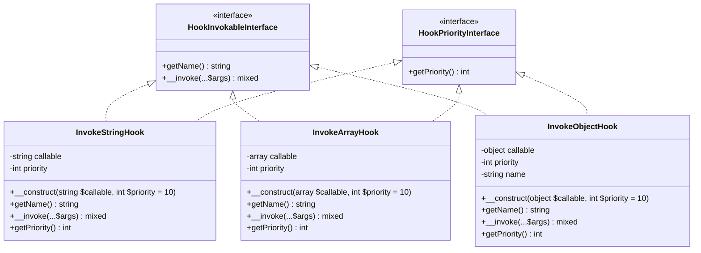
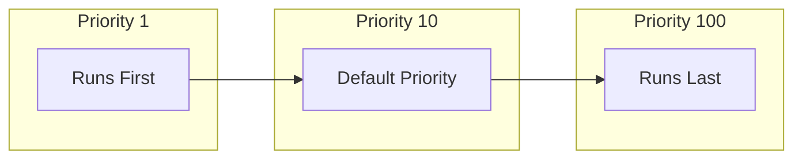

# Entities

Entities in this library wrap PHP callables to provide a uniform interface for hook execution. Each entity implements both `HookInvokableInterface` and `HookPriorityInterface`, handling a specific type of callable with built-in priority support.

## Class Diagram



## Overview

| Entity | Handles | Example |
|--------|---------|---------|
| `InvokeStringHook` | Function names | `'strtoupper'` |
| `InvokeArrayHook` | Array callables | `[$object, 'method']`, `['Class', 'staticMethod']` |
| `InvokeObjectHook` | Closures and invokables | `fn($x) => $x`, `new InvokableClass()` |

---

## InvokeStringHook

Wraps a string function name for execution.

**Namespace:** `SpeedySpec\WP\Hook\Domain\Entities`

**Implements:** `HookInvokableInterface`, `HookPriorityInterface`

### Constructor

```php
public function __construct(
    private string $callable,
    private int $priority = 10,
)
```

| Parameter | Type | Default | Description |
|-----------|------|---------|-------------|
| `$callable` | `string` | (required) | The function name (e.g., `'strtoupper'`) |
| `$priority` | `int` | `10` | Execution priority (lower runs first) |

### Methods

#### getName(): string

Returns the function name as the identifier.

```php
$hook = new InvokeStringHook('strtoupper');
$hook->getName(); // Returns: 'strtoupper'
```

**Throws:** `HookIsNotCallableException` if the function doesn't exist.

#### __invoke(...$args): mixed

Executes the function with the given arguments.

```php
$hook = new InvokeStringHook('strtoupper');
$result = $hook('hello'); // Returns: 'HELLO'
```

#### getPriority(): int

Returns the execution priority.

```php
$hook = new InvokeStringHook('strtoupper', priority: 5);
$hook->getPriority(); // Returns: 5
```

### Example Usage

```php
use SpeedySpec\WP\Hook\Domain\Entities\InvokeStringHook;

// Built-in function with default priority
$hook = new InvokeStringHook('strtoupper');
echo $hook('hello'); // HELLO
echo $hook->getPriority(); // 10

// Custom function with early priority
function my_filter($value) {
    return $value . '_filtered';
}
$hook = new InvokeStringHook('my_filter', priority: 1);
echo $hook('test'); // test_filtered
echo $hook->getPriority(); // 1
```

---

## InvokeArrayHook

Wraps array-style callables for execution, supporting both object methods and static methods.

**Namespace:** `SpeedySpec\WP\Hook\Domain\Entities`

**Implements:** `HookInvokableInterface`, `HookPriorityInterface`

### Constructor

```php
public function __construct(
    private array $callable,
    private int $priority = 10,
)
```

| Parameter | Type | Default | Description |
|-----------|------|---------|-------------|
| `$callable` | `array` | (required) | Array callable: `[$object, 'method']` or `['ClassName', 'staticMethod']` |
| `$priority` | `int` | `10` | Execution priority (lower runs first) |

### Methods

#### getName(): string

Returns a unique identifier based on class and method name.

```php
// Object method
$hook = new InvokeArrayHook([$myObject, 'myMethod']);
$hook->getName(); // Returns: 'MyClass::myMethod'

// Static method
$hook = new InvokeArrayHook(['MyClass', 'staticMethod']);
$hook->getName(); // Returns: 'MyClass::staticMethod'
```

**Throws:** `HookIsNotCallableException` if the callable is invalid.

#### __invoke(...$args): mixed

Executes the method with the given arguments.

```php
$hook = new InvokeArrayHook([$object, 'transform']);
$result = $hook('value'); // Calls $object->transform('value')
```

#### getPriority(): int

Returns the execution priority.

```php
$hook = new InvokeArrayHook([$object, 'method'], priority: 20);
$hook->getPriority(); // Returns: 20
```

### Example Usage

```php
use SpeedySpec\WP\Hook\Domain\Entities\InvokeArrayHook;

// Object method with default priority
class MyProcessor {
    public function process($value) {
        return strtoupper($value);
    }
}

$processor = new MyProcessor();
$hook = new InvokeArrayHook([$processor, 'process']);
echo $hook('hello'); // HELLO
echo $hook->getPriority(); // 10

// Static method with late priority
class Formatter {
    public static function format($value) {
        return "[$value]";
    }
}

$hook = new InvokeArrayHook(['Formatter', 'format'], priority: 100);
echo $hook('test'); // [test]
echo $hook->getPriority(); // 100
```

---

## InvokeObjectHook

Wraps closures and invokable objects for execution.

**Namespace:** `SpeedySpec\WP\Hook\Domain\Entities`

**Implements:** `HookInvokableInterface`, `HookPriorityInterface`

### Constructor

```php
public function __construct(
    private object $callable,
    private int $priority = 10,
)
```

| Parameter | Type | Default | Description |
|-----------|------|---------|-------------|
| `$callable` | `object` | (required) | A closure or object with `__invoke()` method |
| `$priority` | `int` | `10` | Execution priority (lower runs first) |

### Methods

#### getName(): string

Returns a unique identifier based on the object's hash.

For closures:
```php
$hook = new InvokeObjectHook(fn($x) => $x);
$hook->getName(); // Returns: 'abc123...' (spl_object_hash)
```

For invokable objects:
```php
$hook = new InvokeObjectHook(new MyInvokable());
$hook->getName(); // Returns: 'abc123...::__invoke'
```

**Throws:** `HookIsNotCallableException` if the object is not callable.

#### __invoke(...$args): mixed

Executes the callable with the given arguments.

```php
$hook = new InvokeObjectHook(fn($x) => $x * 2);
$result = $hook(5); // Returns: 10
```

#### getPriority(): int

Returns the execution priority.

```php
$hook = new InvokeObjectHook(fn($x) => $x, priority: 5);
$hook->getPriority(); // Returns: 5
```

### Example Usage

```php
use SpeedySpec\WP\Hook\Domain\Entities\InvokeObjectHook;

// Closure with early priority
$hook = new InvokeObjectHook(
    fn($value) => $value . '_processed',
    priority: 1
);
echo $hook('input'); // input_processed
echo $hook->getPriority(); // 1

// Arrow function with context
$multiplier = 3;
$hook = new InvokeObjectHook(fn($x) => $x * $multiplier);
echo $hook(5); // 15

// Invokable class with late priority
class Transformer {
    public function __invoke($value) {
        return strtoupper($value);
    }
}

$hook = new InvokeObjectHook(new Transformer(), priority: 100);
echo $hook('hello'); // HELLO
echo $hook->getPriority(); // 100
```

---

## Priority System



All entities include priority as a constructor parameter:

```php
// Early execution (priority 1)
$early = new InvokeObjectHook(fn($x) => $x, priority: 1);

// Default priority (10)
$default = new InvokeObjectHook(fn($x) => $x);

// Late execution (priority 100)
$late = new InvokeObjectHook(fn($x) => $x, priority: 100);
```

### Priority Guidelines

| Priority | When to Use |
|----------|-------------|
| 1-9 | Critical operations that must run first |
| 10 | Default priority (most callbacks) |
| 11-99 | Operations that need to run after defaults |
| 100+ | Cleanup or finalization operations |

---

## Choosing the Right Entity

The library automatically selects the appropriate entity based on the callback type:

```php
function createInvokable(callable $callback, int $priority = 10): HookInvokableInterface
{
    return match (true) {
        is_string($callback) => new InvokeStringHook($callback, $priority),
        is_array($callback)  => new InvokeArrayHook($callback, $priority),
        default              => new InvokeObjectHook($callback, $priority),
    };
}

// Examples
createInvokable('strtoupper');              // InvokeStringHook
createInvokable([$obj, 'method']);          // InvokeArrayHook
createInvokable(['Class', 'static']);       // InvokeArrayHook
createInvokable(fn($x) => $x);              // InvokeObjectHook
createInvokable(new Invokable());           // InvokeObjectHook

// With priority
createInvokable('strtoupper', priority: 5); // InvokeStringHook with priority 5
```

---

## Error Handling

All entities throw `HookIsNotCallableException` when the callback is invalid:

```php
use SpeedySpec\WP\Hook\Domain\Entities\InvokeStringHook;
use SpeedySpec\WP\Hook\Domain\Exceptions\HookIsNotCallableException;

try {
    $hook = new InvokeStringHook('nonexistent_function');
    $hook->getName(); // Throws exception
} catch (HookIsNotCallableException $e) {
    // Handle invalid callback
}
```

---

## Immutability

Entities are effectively immutable after construction:
- The callable is set once in the constructor
- The priority is set once in the constructor
- There are no setter methods
- The `getName()` result is cached in `InvokeObjectHook`

This ensures consistent behavior when callbacks are stored and retrieved from the hook container.
