# Services

Services in this library provide shared functionality across the hook system. They manage state and coordinate between different parts of the domain.

## Service Architecture


## Overview

| Service | Purpose |
|---------|---------|
| `HookServiceContainer` | Dependency injection and service management |
| `CurrentHookService` | Tracks currently executing hooks and callbacks |
| `HookRunAmountService` | Counts how many times each hook has been executed |

---

## HookServiceContainer

A singleton service container that manages dependency injection for the entire hook system.

**Namespace:** `SpeedySpec\WP\Hook\Domain`

### Service Lifecycle


### Getting the Instance

```php
use SpeedySpec\WP\Hook\Domain\HookServiceContainer;

$container = HookServiceContainer::getInstance();
```

### Methods

#### add(string $reference, callable $registerCallback): self

Registers a service factory with the container.

```php
$container->add(
    HookContainerInterface::class,
    fn($container) => new MemoryHookContainer(
        $container->get(HookRunAmountService::class),
        $container->get(CurrentHookService::class)
    )
);
```

| Parameter | Type | Description |
|-----------|------|-------------|
| `$reference` | `string` | Interface or class name to register |
| `$registerCallback` | `callable` | Factory function that creates the service |

**Returns:** `self` for method chaining

#### remove(string $reference): self

Removes a service registration.

```php
$container->remove(HookContainerInterface::class);
```

| Parameter | Type | Description |
|-----------|------|-------------|
| `$reference` | `string` | Interface or class name to remove |

**Returns:** `self` for method chaining

#### get(string $reference): object

Retrieves a service instance. Instances are cached after first creation.

```php
$hookContainer = $container->get(HookContainerInterface::class);
```

| Parameter | Type | Description |
|-----------|------|-------------|
| `$reference` | `string` | Interface or class name to retrieve |

**Returns:** The service instance

**Throws:** `RuntimeException` if the service is not registered

### Example: Full Setup

```php
use SpeedySpec\WP\Hook\Domain\HookServiceContainer;
use SpeedySpec\WP\Hook\Domain\Services\CurrentHookService;
use SpeedySpec\WP\Hook\Domain\Services\HookRunAmountService;
use SpeedySpec\WP\Hook\Domain\Contracts\HookContainerInterface;
use SpeedySpec\WP\Hook\Infra\Memory\Services\MemoryHookContainer;

$container = HookServiceContainer::getInstance();

// Register services
$container
    ->add(CurrentHookService::class, fn() => new CurrentHookService())
    ->add(HookRunAmountService::class, fn() => new HookRunAmountService())
    ->add(HookContainerInterface::class, fn($c) => new MemoryHookContainer(
        $c->get(HookRunAmountService::class),
        $c->get(CurrentHookService::class)
    ));

// Use services
$hooks = $container->get(HookContainerInterface::class);
```

---

## CurrentHookService

Tracks the currently executing hooks and callbacks. Maintains a stack to support nested hook execution.

**Namespace:** `SpeedySpec\WP\Hook\Domain\Services`

### Hook Stack Visualization

```mermaid
flowchart TB
    subgraph "Hook Execution Stack"
        direction TB
        H1[init]
        H2[plugins_loaded]
        H3[my_custom_hook]
        H1 --> H2 --> H3
    end

    subgraph "Callback Stack (current hook)"
        direction TB
        C1[callback_1]
        C2[callback_2]
        C3[callback_3 ← current]
        C1 --> C2 --> C3
    end
```



### Constructor

```php
public function __construct(
    private array $hooks = [],
    private array $callbacks = [],
)
```

### Hook Tracking Methods

#### addHook(string $name): void

Push a hook onto the execution stack.

```php
$service->addHook('init');
```

#### removeHook(): void

Pop the current hook from the execution stack.

```php
$service->removeHook();
```

#### getCurrentHook(): ?HookNameInterface

Get the currently executing hook.

```php
$current = $service->getCurrentHook();
if ($current) {
    echo "Currently running: " . $current->getName();
}
```

#### hookTraceback(): array

Get the full stack of executing hooks.

```php
$stack = $service->hookTraceback();
// ['init', 'plugins_loaded', 'my_custom_hook']
```

### Callback Tracking Methods

#### addCallback(string $name): void

Track a callback execution within the current hook.

```php
$service->addCallback('MyClass::myMethod');
```

#### removeCallback(): void

Remove the current callback from tracking.

```php
$service->removeCallback();
```

#### getCurrentCallback(): ?string

Get the currently executing callback.

```php
$callback = $service->getCurrentCallback();
// 'MyClass::myMethod'
```

#### callbackTraceback(): array

Get all callbacks for the current hook.

```php
$callbacks = $service->callbackTraceback();
// ['callback1', 'callback2', 'callback3']
```

#### entireCallbackTraceback(): array

Get callbacks for all hooks.

```php
$all = $service->entireCallbackTraceback();
// [
//     'init' => ['callback1', 'callback2'],
//     'wp_loaded' => ['callback3']
// ]
```

### Example: Hook Execution Tracking

```php
use SpeedySpec\WP\Hook\Domain\Services\CurrentHookService;

$service = new CurrentHookService();

// Simulate hook execution
$service->addHook('init');
$service->addCallback('MyPlugin::init');

echo $service->getCurrentHook()->getName();  // 'init'
echo $service->getCurrentCallback();          // 'MyPlugin::init'

$service->removeCallback();
$service->removeHook();
```

---

## HookRunAmountService

Tracks how many times each hook has been executed. Useful for `did_action()` and `did_filter()` functionality.

**Namespace:** `SpeedySpec\WP\Hook\Domain\Services`

### Execution Counting


### Methods

#### getRunAmount(HookNameInterface $name): int

Get the number of times a hook has been executed.

```php
$count = $service->getRunAmount(new StringHookName('init'));
// 3
```

#### incrementRunAmount(HookNameInterface $name): void

Increment the execution count for a hook.

```php
$service->incrementRunAmount(new StringHookName('init'));
```

### Example Usage

```php
use SpeedySpec\WP\Hook\Domain\Services\HookRunAmountService;
use SpeedySpec\WP\Hook\Domain\ValueObject\StringHookName;

$service = new HookRunAmountService();
$initHook = new StringHookName('init');

echo $service->getRunAmount($initHook); // 0

$service->incrementRunAmount($initHook);
echo $service->getRunAmount($initHook); // 1

$service->incrementRunAmount($initHook);
echo $service->getRunAmount($initHook); // 2
```

---

## Service Lifecycle

### Initialization Order


Services should be initialized in dependency order:

```php
$container = HookServiceContainer::getInstance();

// 1. Services with no dependencies first
$container->add(CurrentHookService::class, fn() => new CurrentHookService());
$container->add(HookRunAmountService::class, fn() => new HookRunAmountService());

// 2. Services that depend on others
$container->add(HookContainerInterface::class, fn($c) => new MemoryHookContainer(
    $c->get(HookRunAmountService::class),
    $c->get(CurrentHookService::class)
));

// 3. Use cases that depend on containers
$container->add(LegacyAddFilterUseCaseInterface::class, fn($c) =>
    new LegacyAddFilterUseCase($c->get(HookContainerInterface::class))
);
```

### Instance Caching

The container caches instances after first creation:

```php
$hooks1 = $container->get(HookContainerInterface::class);
$hooks2 = $container->get(HookContainerInterface::class);

$hooks1 === $hooks2; // true - same instance
```

---

## Testing with Services

Services can be mocked or replaced for testing:

```php
// Register mock implementations
$container->add(CurrentHookService::class, fn() => new MockCurrentHookService());

// Or use the actual services in isolated tests
$currentHookService = new CurrentHookService();
$hookRunAmountService = new HookRunAmountService();

$hookContainer = new MemoryHookContainer(
    $hookRunAmountService,
    $currentHookService
);

// Test with isolated instances
$hookContainer->dispatch(new StringHookName('test'));
assertEquals(1, $hookRunAmountService->getRunAmount(new StringHookName('test')));
```
