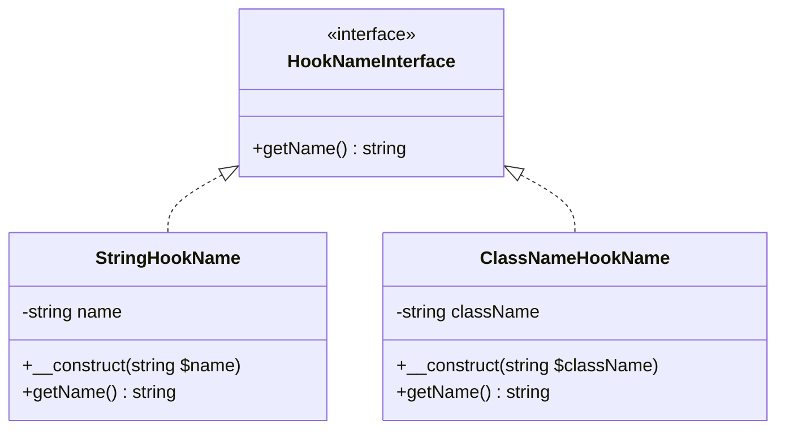
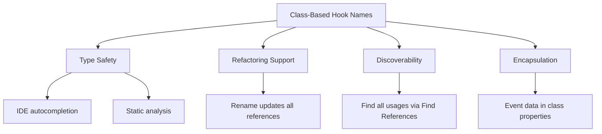
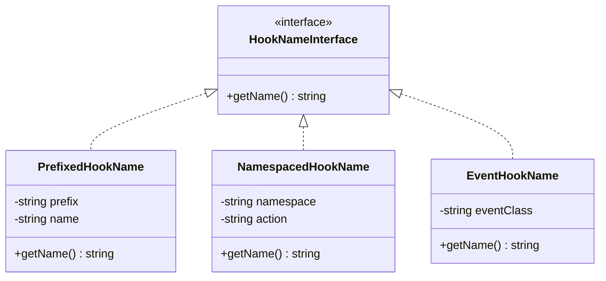

# Value Objects

Value objects are immutable objects that represent domain concepts. They have no identity beyond their value and are compared by their attributes rather than by reference.

## Class Diagram



## Overview

| Value Object | Purpose | Example |
|--------------|---------|---------|
| `StringHookName` | Represents a hook name as a string | `'init'`, `'wp_footer'` |
| `ClassNameHookName` | Represents a hook name derived from a class | `MyEvent::class` |

---

## StringHookName

Represents a hook name as a simple string. This is the most common hook name type, used for traditional WordPress hooks.

**Namespace:** `SpeedySpec\WP\Hook\Domain\ValueObject`

**Implements:** `HookNameInterface`

### Constructor

```php
public function __construct(private string $name)
```

| Parameter | Type | Description |
|-----------|------|-------------|
| `$name` | `string` | The hook name |

### Methods

#### getName(): string

Returns the string representation of the hook name.

```php
$hookName = new StringHookName('wp_footer');
$hookName->getName(); // Returns: 'wp_footer'
```

### Example Usage

```php
use SpeedySpec\WP\Hook\Domain\ValueObject\StringHookName;
use SpeedySpec\WP\Hook\Domain\Entities\ObjectHookInvoke;

// Standard WordPress hooks
$initHook = new StringHookName('init');
$footerHook = new StringHookName('wp_footer');
$filterHook = new StringHookName('the_content');

// Custom hooks
$customHook = new StringHookName('my_plugin_action');

// Using with container
$container->add(
    $initHook,
    new ObjectHookInvoke(fn() => doSomething())
);

$container->dispatch($initHook);
$container->filter($filterHook, $content);
```

### Common WordPress Hook Names

```php
// Actions
new StringHookName('init');
new StringHookName('wp_loaded');
new StringHookName('wp_head');
new StringHookName('wp_footer');
new StringHookName('admin_init');
new StringHookName('save_post');

// Filters
new StringHookName('the_content');
new StringHookName('the_title');
new StringHookName('body_class');
new StringHookName('excerpt_length');
```

---

## ClassNameHookName

Represents a hook name derived from a class name. Useful for event-driven architectures where hooks are tied to specific event classes.

**Namespace:** `SpeedySpec\WP\Hook\Domain\ValueObject`

**Implements:** `HookNameInterface`

### Constructor

```php
public function __construct(private string $className)
```

| Parameter | Type | Description |
|-----------|------|-------------|
| `$className` | `string` | Fully qualified class name |

### Methods

#### getName(): string

Returns the class name as the hook name.

```php
$hookName = new ClassNameHookName(UserCreated::class);
$hookName->getName(); // Returns: 'App\Events\UserCreated'
```

### Example Usage

```php
use SpeedySpec\WP\Hook\Domain\ValueObject\ClassNameHookName;
use SpeedySpec\WP\Hook\Domain\Entities\ObjectHookInvoke;

// Define event classes
namespace App\Events;

class UserCreated {}
class PostPublished {}
class OrderCompleted {}

// Use class names as hook names
$userCreatedHook = new ClassNameHookName(UserCreated::class);
$postPublishedHook = new ClassNameHookName(PostPublished::class);

// Register handlers with priority in the entity
$container->add(
    $userCreatedHook,
    new ObjectHookInvoke(
        fn($event) => handleUserCreated($event),
        priority: 10
    )
);

// Dispatch events
$container->dispatch($userCreatedHook, $event);
```

### Benefits of Class-Based Hook Names



1. **Type Safety**: IDE autocompletion and static analysis
2. **Refactoring**: Renaming classes updates all references
3. **Discovery**: Find all usages via "Find References"
4. **Encapsulation**: Event data can be in the class

---

## Immutability

All value objects are immutable:

```php
// StringHookName - no setters, value fixed at construction
$hookName = new StringHookName('init');
// There's no way to change the name after construction

// To use a different name, create a new instance
$differentHook = new StringHookName('admin_init');
```

---

## Value Object Equality

Value objects should be compared by value, not reference:

```php
$name1 = new StringHookName('init');
$name2 = new StringHookName('init');

// Reference comparison (false)
$name1 === $name2; // false

// Value comparison (true)
$name1->getName() === $name2->getName(); // true
```

---

## Creating Custom Hook Name Types

Implement `HookNameInterface` for custom naming strategies:



### Prefixed Hook Names

```php
use SpeedySpec\WP\Hook\Domain\Contracts\HookNameInterface;

class PrefixedHookName implements HookNameInterface
{
    public function __construct(
        private string $prefix,
        private string $name
    ) {}

    public function getName(): string
    {
        return $this->prefix . '_' . $this->name;
    }
}

// Usage
$hook = new PrefixedHookName('myplugin', 'init');
$hook->getName(); // 'myplugin_init'
```

### Namespaced Hook Names

```php
class NamespacedHookName implements HookNameInterface
{
    public function __construct(
        private string $namespace,
        private string $action
    ) {}

    public function getName(): string
    {
        return $this->namespace . '/' . $this->action;
    }
}

// Usage
$hook = new NamespacedHookName('shop', 'order.created');
$hook->getName(); // 'shop/order.created'
```

### Event-Based Hook Names

```php
class EventHookName implements HookNameInterface
{
    public function __construct(private string $eventClass) {}

    public function getName(): string
    {
        return 'event:' . $this->eventClass;
    }
}

// Usage
$hook = new EventHookName(UserCreated::class);
$hook->getName(); // 'event:App\Events\UserCreated'
```

---

## Best Practices

When working with value objects in this library:

1. **Always use value comparison**: Compare value objects by their `getName()` result, not by reference
2. **Create new instances**: Since value objects are immutable, create new instances for different values
3. **Use type hints**: Leverage `HookNameInterface` in type hints for flexibility
4. **Choose the right type**: Use `StringHookName` for traditional hooks, `ClassNameHookName` for event-driven architectures

```php
// Good: Value comparison
if ($hook1->getName() === $hook2->getName()) {
    // Same hook name
}

// Bad: Reference comparison
if ($hook1 === $hook2) {
    // Will be false even if names match
}
```
